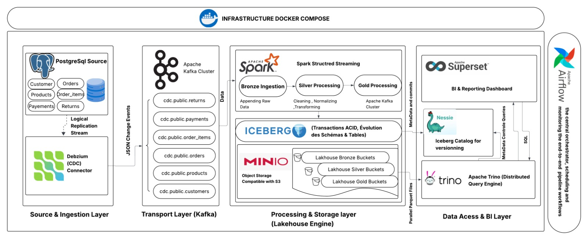
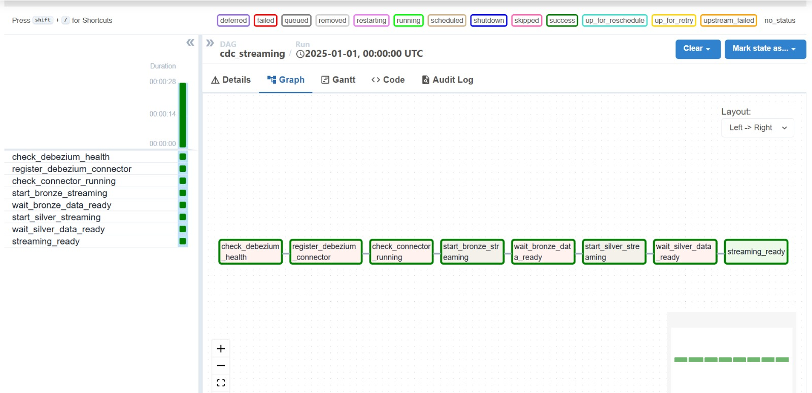
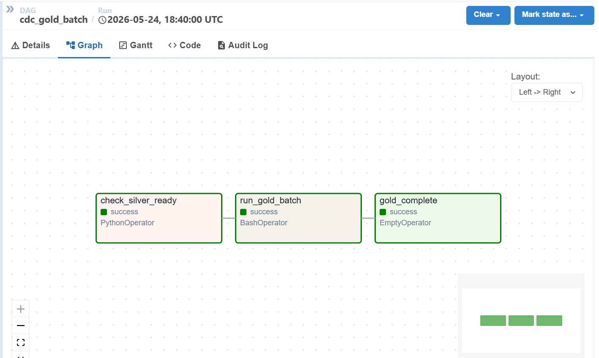
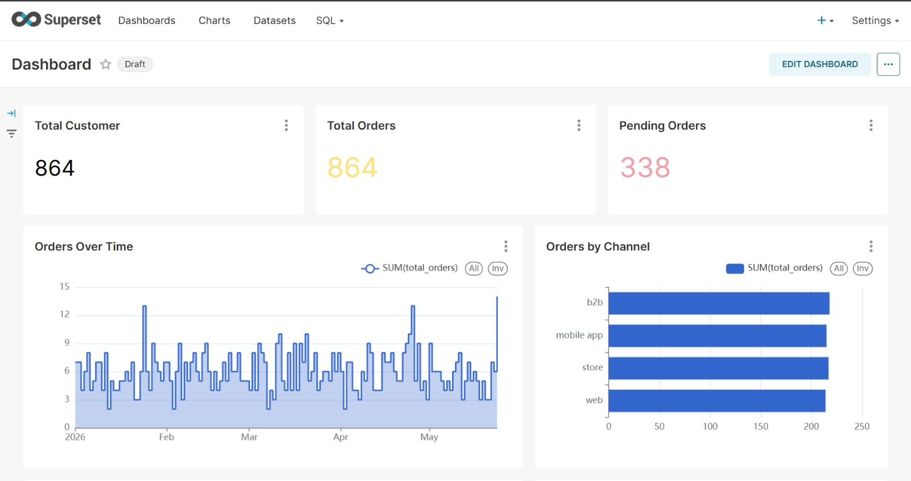

<div align="center">

# 🏗️ Realtime CDC Lakehouse

### A production-grade, end-to-end Change Data Capture pipeline feeding a real-time analytical lakehouse

[](https://www.postgresql.org/)
[](https://kafka.apache.org/)
[](https://spark.apache.org/)
[](https://iceberg.apache.org/)
[](https://airflow.apache.org/)
[](https://docs.docker.com/compose/)
[](https://www.python.org/)

</div>

---

## 📌 Table of Contents

- [Overview](#-overview)
- [Architecture & Data Flow](#-architecture--data-flow)
- [Tech Stack](#-tech-stack)
- [Medallion Architecture](#-medallion-architecture)
- [Airflow Orchestration](#-airflow-orchestration)
- [KPI Indicators](#-kpi-indicators)
- [Project Structure](#-project-structure)
- [Project Advancement](#-project-advancement)
- [Prerequisites](#-prerequisites)
- [Quick Start](#-quick-start)
- [Service URLs](#-service-urls)
- [Running the Platform Step-by-Step](#-running-the-platform-step-by-step)
- [Querying with Trino](#-querying-with-trino)
- [Environment Variables](#️-environment-variables)
- [Monitoring](#-monitoring)
- [Contributing](#-contributing)
- [License](#-license)

---

## 🎯 Overview

This project implements a **real-time Change Data Capture (CDC) data lakehouse** that continuously captures every `INSERT`, `UPDATE`, and `DELETE` from a PostgreSQL transactional database and propagates those changes through a fully automated streaming pipeline — with near-zero latency, ACID guarantees, and full schema evolution support.

### Context & Problem Statement

Modern enterprises rely on multiple operational systems (ERP, CRM, order management) that evolve continuously through transactional mutations. Periodic full exports to feed analytical platforms are no longer efficient: they introduce high latency, waste resources, and complicate synchronization. This project answers the question:

> *How to design a modern Big Data architecture capable of capturing changes from an operational database, transporting them as events, and transforming them to feed a near-real-time analytical platform?*

### Key Capabilities

- **Real-time Ingestion** — Debezium CDC captures WAL events from PostgreSQL with sub-second latency.
- **Event-Driven Transport** — Apache Kafka carries CDC events as JSON messages across 6 dedicated topics.
- **Medallion Lakehouse** — Spark Structured Streaming processes data through Bronze → Silver → Gold layers.
- **ACID Table Format** — Apache Iceberg provides transactions, schema evolution, and time-travel queries.
- **Git-like Catalog** — Project Nessie manages Iceberg metadata with branching and versioning.
- **S3-Compatible Storage** — MinIO stores all Parquet files organized across 3 lakehouse buckets.
- **Distributed SQL** — Apache Trino enables high-performance analytical queries directly on Iceberg tables.
- **BI Dashboards** — Apache Superset visualizes all KPIs through Trino-backed data connections.
- **Orchestrated Pipelines** — Apache Airflow schedules and monitors the full end-to-end workflow.
- **Fully Containerized** — 20+ services launch with a single `docker compose up --build`.

---

## 🗺️ Architecture & Data Flow



*Figure 1: Complete infrastructure architecture showing the end-to-end CDC pipeline from PostgreSQL source to BI layer*

### Data Flow Summary

1. A Python **data generator** continuously runs realistic business mutations (`INSERT`, `UPDATE`, `DELETE`) on the PostgreSQL source database.
2. **Debezium** reads the PostgreSQL Write-Ahead Log (WAL) via logical replication and publishes every row-level change as a structured JSON event to a dedicated Kafka topic.
3. **Kafka** reliably transports CDC events, retaining them for 7 days (`KAFKA_LOG_RETENTION_HOURS=168`).
4. **Spark Bronze job** consumes all Kafka topics via Structured Streaming and appends raw Debezium envelopes into Bronze Iceberg tables (10-second micro-batch trigger).
5. **Spark Silver job** reads Bronze tables as a stream, deserializes payloads, normalizes fields, deduplicates by primary key, and appends into Silver Iceberg tables (30-second trigger).
6. **Spark Gold job** performs batch joins and aggregations across all Silver tables, producing business-ready KPI tables in the Gold layer.
7. **Apache Trino** queries all three Iceberg layers through the shared Nessie catalog.
8. **Apache Superset** visualizes KPIs via live Trino connections.

---

## 🛠️ Tech Stack

| Layer | Technology | Version | Role |
|:---|:---|:---|:---|
| **Source Database** | PostgreSQL | 15-alpine | Transactional source with `wal_level=logical` replication |
| **CDC Engine** | Debezium | 2.4 | Captures row-level `INSERT`/`UPDATE`/`DELETE` as JSON events |
| **Message Broker** | Apache Kafka | 7.5.0 (Confluent) | Durable event streaming backbone (6 CDC topics, 3 partitions each) |
| **Coordination** | Apache ZooKeeper | 7.5.0 (Confluent) | Kafka cluster coordination |
| **Stream Processing** | Apache Spark | 3.5.1 | Structured Streaming for Bronze & Silver; Batch for Gold |
| **Table Format** | Apache Iceberg | 1.5.2 | ACID transactions, schema evolution, partition pruning, time-travel |
| **Iceberg Catalog** | Project Nessie | 0.71.0 | Git-like versioning and metadata management for Iceberg tables |
| **Object Storage** | MinIO | latest | S3-compatible physical storage for all Parquet data files |
| **Query Engine** | Apache Trino | 435 | Distributed SQL engine for analytical queries over Iceberg |
| **BI Platform** | Apache Superset | 3.1.0 | Dashboards and KPI visualization via Trino connection |
| **Orchestration** | Apache Airflow | 2.9.1 | Pipeline scheduling, DAG management, and monitoring |
| **Data Simulation** | Python | 3.x | Realistic CDC traffic generation against PostgreSQL |
| **Infrastructure** | Docker Compose | v3.9 | Full platform containerization (20+ services) |

---

## 🏅 Medallion Architecture

The lakehouse is organized in three progressive quality layers, each backed by Apache Iceberg tables on MinIO.

### 🥉 Bronze Layer — Raw CDC Ingestion

The Bronze layer is an **append-only, immutable audit log** of every CDC event received from Kafka. No transformation is applied — the goal is maximum fidelity and full replayability.

**Kafka topics consumed:**

| Topic | Source Table |
|:---|:---|
| `postgres.public.customers` | Customer master data |
| `postgres.public.products` | Product catalog |
| `postgres.public.orders` | Order headers |
| `postgres.public.order_items` | Line items per order |
| `postgres.public.payments` | Payment records |
| `postgres.public.returns` | Return and refund records |

**Processing logic:**
- Reads raw Kafka messages via Spark Structured Streaming (`startingOffsets=earliest`).
- Extracts `op` (operation: `c`/`u`/`r`/`d`), `after` (post-change payload), and Kafka metadata.
- Filters to retain only `c` (create), `u` (update), and `r` (read/snapshot) events.
- Writes with a **10-second micro-batch trigger** to `iceberg.bronze.*`.

**Bronze Iceberg tables (bucket: `lakehouse-bronze`):**

| Table | Primary Key | Notable Business Fields |
|:---|:---|:---|
| `bronze.customers` | `customer_id` | `full_name`, `city`, `segment`, `registration_date` |
| `bronze.products` | `product_id` | `category`, `brand`, `unit_price`, `stock_qty` |
| `bronze.orders` | `order_id` | `customer_id`, `order_date`, `status`, `channel` |
| `bronze.order_items` | `order_item_id` | `order_id`, `product_id`, `quantity`, `total_amount` |
| `bronze.payments` | `payment_id` | `order_id`, `payment_date`, `payment_method`, `amount` |
| `bronze.returns` | `return_id` | `order_id`, `return_date`, `reason`, `status` |

---

### 🥈 Silver Layer — Cleaned & Conformed

The Silver layer holds **state-synchronized, business-conformed entities**. It reads Bronze tables as a stream and applies normalization rules before appending with a **30-second trigger**.

**Transformations applied:**

| Table | Transformations |
|:---|:---|
| `silver.customers` | Null checks, deduplication by key, timestamp casting, lowercase segments, trimming |
| `silver.products` | Deduplication, timestamp casting, trim categories/brands |
| `silver.orders` | Null checks, deduplication, lowercase status/channel |
| `silver.order_items` | Filter `quantity > 0`, deduplication |
| `silver.payments` | Null checks, deduplication, lowercase payment method/status |
| `silver.returns` | Null checks, deduplication, lowercase reason/status |

All Silver tables carry audit columns: `_ingested_at` (processing timestamp) and `_op` (CDC operation type).

---

### 🥇 Gold Layer — Business Intelligence Ready

The Gold layer produces **analytical facts and aggregated KPI tables** via batch reads of Silver, followed by structured joins and aggregations.

**Gold tables (bucket: `lakehouse-gold`):**

| Table | Grain | Key Metrics |
|:---|:---|:---|
| `gold.gold_sales_facts` | order_date, channel, status, segment | order_count, unique_customers, total_items |
| `gold.gold_daily_revenue` | order_date, channel | total_orders, completion_rate, cancellation_rate |
| `gold.gold_payments_summary` | payment_date, method, status | payment_count, success_rate, avg_days_to_payment |
| `gold.gold_returns_summary` | return_date, reason, status | return_count, unique_orders, avg_days_to_return |
| `gold.gold_customer_segments` | segment, city | customer_count, avg_orders_per_customer |
| `gold.gold_product_performance` | category, brand | items_sold, return_rate |

---

## ✈️ Airflow Orchestration

Apache Airflow (port `8089`) is the central orchestrator scheduling and monitoring the full end-to-end pipeline.

### DAG 1: `cdc_streaming` — Pipeline Initialization

Runs once at startup to validate and initialize the full streaming pipeline. Total runtime: ~28 seconds.



*Figure 2: Airflow DAG for streaming pipeline initialization — health checks, connector registration, and stream startup*

**DAG Tasks:**

| Task | Operator | Purpose |
|:---|:---|:---|
| `check_debezium_health` | PythonOperator | Verifies Debezium REST API is reachable |
| `register_debezium_connector` | PythonOperator | Creates PostgreSQL CDC connector if not exists |
| `check_connector_running` | PythonOperator | Waits for connector to reach RUNNING state |
| `start_bronze_streaming` | PythonOperator | Submits Bronze ingestion Spark job |
| `wait_bronze_data_ready` | PythonOperator | Validates Bronze tables contain data |
| `start_silver_streaming` | PythonOperator | Submits Silver processing Spark job |
| `wait_silver_data_ready` | PythonOperator | Validates Silver tables contain data |
| `streaming_ready` | EmptyOperator | Terminal marker signaling pipeline ready |

### DAG 2: `cdc_gold_batch` — Gold Batch Refresh

Periodically triggered to recompute the entire Gold analytics layer from current Silver data.



*Figure 3: Airflow DAG for Gold batch processing — validates Silver readiness and triggers aggregation job*

**DAG Tasks:**

| Task | Operator | Purpose |
|:---|:---|:---|
| `check_silver_ready` | PythonOperator | Confirms Silver tables have recent data |
| `run_gold_batch` | BashOperator | Submits Gold batch aggregation Spark job |
| `gold_complete` | EmptyOperator | Terminal marker signaling batch completion |

---

## 📊 KPI Indicators

All indicators are queryable via Trino against the Gold layer and visualized in Apache Superset:



*Figure 4: Apache Superset dashboard showing real-time KPIs — total customers, orders, pending orders, and trend analysis*

| Indicator | Source Table |
|:---|:---|
| CDC events captured per table | `bronze.*` |
| INSERT/UPDATE/DELETE breakdown | `bronze.*` (by `op` column) |
| Order volume evolution | `gold.gold_daily_revenue` |
| Order completion & cancellation rates | `gold.gold_daily_revenue` |
| Revenue by channel | `gold.gold_daily_revenue` |
| Payments by method & status | `gold.gold_payments_summary` |
| Payment success rate | `gold.gold_payments_summary` |
| Return rate & reasons | `gold.gold_returns_summary` |
| Customer distribution | `gold.gold_customer_segments` |
| Product performance | `gold.gold_product_performance` |

---
## 🗂️ Project Structure

```text
realtime-cdc-lakehouse/
│
├── docker-compose.yml                 # Full platform (20+ services)
├── .env.example                       # Environment variable template
├── .gitignore
│
├── airflow/
│   └── dags/
│       ├── cdc_streaming.py           # Streaming pipeline init DAG (8 tasks)
│       └── cdc_gold_batch.py          # Gold batch refresh DAG (3 tasks)
│
├── data-generator/
│   ├── Dockerfile                     # Python simulator container
│   └── generator.py                   # Realistic INSERT/UPDATE/DELETE traffic
│
├── database/
│   └── init.sql                       # Schema definitions for 6 business tables
│
├── debezium/
│   └── connector-config.json          # Debezium PostgreSQL connector configuration
│
├── scripts/
│   ├── init-db.sh                     # PostgreSQL init: enables logical replication
│   └── validate_schema_evolution.py   # Schema evolution validation helper
│
├── spark/
│   ├── Dockerfile                     # Custom Spark 3.5.1 image + Iceberg/Kafka JARs
│   ├── entrypoint-gold.sh             # Gold layer startup entrypoint
│   ├── jobs/
│   │   ├── bronze_ingestion.py        # Kafka → Bronze (append, 10s trigger)
│   │   ├── silver_processing.py       # Bronze → Silver (normalize, 30s trigger)
│   │   └── gold_processing.py         # Silver → Gold (batch aggregations)
│   └── config/                        # Spark job configuration files
│
├── spark-conf/
│   └── spark-defaults.conf            # Spark cluster default configuration
│
└── trino/
    ├── catalogs/
    │   └── iceberg.properties         # Trino → Nessie/Iceberg catalog connector
    └── queries/
        └── kpi_queries.sql            # Ready-to-use KPI SQL pack
```

---

## ✅ Project Advancement

| Phase | Milestone | Status |
|:---|:---|:---|
| **Phase 1** | Operational DB — 6-table schema, logical replication configured, seed data | 🟢 Completed |
| **Phase 2** | Ingestion & Transport — Kafka, Debezium connector, MinIO buckets, Nessie catalog | 🟢 Completed |
| **Phase 3** | Data Generation — Python CRUD simulator running continuously on PostgreSQL | 🟢 Completed |
| **Phase 4** | Stream Processing — Bronze, Silver, and Gold Spark jobs fully operational | 🟢 Completed |
| **Phase 5** | Lakehouse Storage — Unified Nessie/Iceberg catalog, Parquet on MinIO (3 buckets) | 🟢 Completed |
| **Phase 6** | Analytical Engine — Trino configured with Iceberg catalog + KPI SQL pack | 🟢 Completed |
| **Phase 7** | Orchestration — Airflow DAGs (`cdc_streaming` + `cdc_gold_batch`) operational | 🟢 Completed |
| **Phase 8** | Visualization & BI — Apache Superset dashboards connected to Trino | 🟢 Completed |

---

## 📋 Prerequisites

| Requirement | Minimum |
|:---|:---|
| Docker Engine | ≥ 24.x |
| Docker Compose | ≥ 2.20 |
| RAM allocated to Docker | **16 GB** (the full stack is ~20 containers) |
| CPU cores | **4 cores** |
| Free disk space | **~15 GB** (images + Parquet data volumes) |

## 🚀 Quick Start
 
```bash
# 1. Clone the repository
git clone https://github.com/yousseffalag/realtime-cdc-lakehouse.git
cd realtime-cdc-lakehouse
 
# 2. Configure environment variables
cp .env.example .env
# Edit .env if you want to change credentials (defaults work for local dev)
 
# 3. Build the custom Spark image and start all services
docker compose up --build -d
 
# 4. Wait for all services to become healthy (~2–3 minutes on first run)
docker compose ps
 
# 5. Open Airflow at http://localhost:8089
#    → Enable and trigger the 'cdc_streaming' DAG (initializes Debezium + Spark streams)
 
# 6. Once streaming is confirmed healthy, trigger 'cdc_gold_batch' DAG
#    → This runs the Gold aggregation batch job
 
# 7. Open Trino at http://localhost:8090 and run your first query:
#    SELECT COUNT(*) FROM iceberg.bronze.orders;
```
 
---
 
## 🌐 Service URLs
 
| Service | URL | Credentials |
|:---|:---|:---|
| **Apache Airflow** | http://localhost:8089 | `admin` / `admin` |
| **Spark Master UI** | http://localhost:8080 | — |
| **Spark Worker 1** | http://localhost:8081 | — |
| **Spark Worker 2** | http://localhost:8082 | — |
| **Apache Superset** | http://localhost:8088 | `admin` / `admin` |
| **Trino Web UI** | http://localhost:8090 | — |
| **MinIO Console** | http://localhost:9001 | `minioadmin` / `minioadmin` |
| **MinIO S3 API** | http://localhost:9000 | — |
| **Debezium REST API** | http://localhost:8083 | — |
| **Project Nessie** | http://localhost:19120 | — |
| **PostgreSQL** | `localhost:5432` | `cdc_user` / `cdc_pass` |
| **Kafka (external)** | `localhost:29092` | — |
| **ZooKeeper** | `localhost:2181` | — |
 
---
 
## 🔧 Running the Platform Step-by-Step
 
### Step 1 — Start the Infrastructure
 
```bash
docker compose up --build -d
```
 
Verify all containers are healthy:
 
```bash
docker compose ps
```

### Step 2 — Register the Debezium Connector

The `cdc_streaming` Airflow DAG handles connector registration automatically during pipeline initialization.

If you prefer to register the connector manually, execute the helper script provided in the `debezium/` directory:

```bash
chmod +x debezium/register-connector.sh
./debezium/register-connector.sh
```

The script submits the connector configuration defined in `debezium/connectors/postgres-connector.json` to the Debezium Connect REST API.

Verify the connector status:

```bash
curl http://localhost:8083/connectors/postgres-cdc-connector/status
```

Expected result:

```json
{
  "name": "postgres-cdc-connector",
  "connector": {
    "state": "RUNNING"
  }
}
```
 
### Step 3 — Monitor Spark Jobs
 
The three Spark jobs launch automatically via Docker Compose. Follow their logs:
 
```bash
docker logs -f cdc-bronze-ingestion
docker logs -f cdc-silver-processing
docker logs -f cdc-gold-processing
```
 
Check running applications at the **Spark Master UI**: http://localhost:8080
 
You should see `BronzeIngestion` and `SilverProcessing` listed as **RUNNING**, and `GoldProcessing` as **FINISHED** after each batch run.
 
### Step 4 — Browse Lakehouse Buckets
 
Open **MinIO Console** at http://localhost:9001 and inspect:
 
| Bucket | Contents |
|:---|:---|
| `lakehouse-bronze` | Raw Iceberg tables — full CDC history |
| `lakehouse-silver` | Cleaned Iceberg tables — conformed entities |
| `lakehouse-gold` | Aggregated Iceberg tables — business KPIs |
 
---
 
## 🔍 Querying with Trino
 
Connect to Trino via the web UI at http://localhost:8090, or via CLI:
 
```bash
docker exec -it cdc-trino trino
```
 
### Explore the Lakehouse
 
```sql
-- List all available tables per layer
SHOW TABLES IN iceberg.bronze;
SHOW TABLES IN iceberg.silver;
SHOW TABLES IN iceberg.gold;
```
 
### CDC Monitoring Queries
 
```sql
-- Count CDC events captured per table
SELECT 'customers' AS table_name, COUNT(*) AS events FROM iceberg.bronze.customers
UNION ALL SELECT 'orders', COUNT(*) FROM iceberg.bronze.orders
UNION ALL SELECT 'products', COUNT(*) FROM iceberg.bronze.products
UNION ALL SELECT 'payments', COUNT(*) FROM iceberg.bronze.payments
UNION ALL SELECT 'returns', COUNT(*) FROM iceberg.bronze.returns;
 
-- Breakdown of INSERTs, UPDATEs, DELETEs per table
SELECT op,
  CASE op WHEN 'c' THEN 'INSERT' WHEN 'u' THEN 'UPDATE' WHEN 'd' THEN 'DELETE' ELSE op END AS operation,
  COUNT(*) AS event_count
FROM iceberg.bronze.orders
GROUP BY op
ORDER BY event_count DESC;
```
 
### Business KPI Queries
 
```sql
-- Daily revenue and order completion rate
SELECT order_date, channel, total_orders, completion_rate_pct, cancellation_rate_pct
FROM iceberg.gold.gold_daily_revenue
ORDER BY order_date DESC
LIMIT 30;
 
-- Payment success rate by method
SELECT payment_method,
       SUM(payment_count) AS total_payments,
       ROUND(AVG(success_rate_pct), 2) AS avg_success_rate_pct,
       ROUND(AVG(avg_days_to_payment), 1) AS avg_days_to_payment
FROM iceberg.gold.gold_payments_summary
GROUP BY payment_method
ORDER BY total_payments DESC;
 
-- Return analysis by reason
SELECT reason, status,
       SUM(return_count) AS total_returns,
       ROUND(AVG(avg_days_to_return), 1) AS avg_days_to_return
FROM iceberg.gold.gold_returns_summary
GROUP BY reason, status
ORDER BY total_returns DESC;
 
-- Customer segmentation overview
SELECT segment, city, customer_count, total_orders, active_customers,
       ROUND(avg_orders_per_customer, 2) AS avg_orders_per_customer
FROM iceberg.gold.gold_customer_segments
ORDER BY total_orders DESC;
 
-- Top product categories by items sold and return rate
SELECT category, brand, total_items_sold, return_rate_pct
FROM iceberg.gold.gold_product_performance
ORDER BY total_items_sold DESC
LIMIT 10;
 
-- Orders by status and channel (Silver layer)
SELECT status, channel, COUNT(*) AS order_count
FROM iceberg.silver.orders
GROUP BY status, channel
ORDER BY order_count DESC;
```
 
---
 
## ⚙️ Environment Variables
 
Copy `.env.example` to `.env` and customize as needed:
 
```env
# ── PostgreSQL ──────────────────────────────────
POSTGRES_DB=cdc_source
POSTGRES_USER=cdc_user
POSTGRES_PASSWORD=cdc_pass
 
# ── MinIO Object Storage ────────────────────────
MINIO_ACCESS_KEY=minioadmin
MINIO_SECRET_KEY=your_strong_secret_key
 
# ── Apache Superset ─────────────────────────────
SUPERSET_SECRET_KEY=your_flask_secret_key
SUPERSET_ADMIN_USER=admin
SUPERSET_ADMIN_PASSWORD=admin
SUPERSET_ADMIN_EMAIL=admin@example.com
 
# ── Apache Airflow ──────────────────────────────
AIRFLOW_FERNET_KEY=46BKJoQYlPPOexq0OhDZnIlNepKFf87WFwLt0nQ8G00=
AIRFLOW_SECRET_KEY=airflow_secret_change_me
AIRFLOW_ADMIN_USER=admin
AIRFLOW_ADMIN_PASSWORD=admin


 
## 📡 Monitoring
 
### Spark Master UI — http://localhost:8080
 
Shows the Spark cluster status in real time:
 
- **2 Workers** alive (172.27.0.7 and 172.27.0.8) with a combined 6 cores and 11.7 GiB RAM
- **Running applications**: `BronzeIngestion` and `SilverProcessing` (Structured Streaming, continuous)
- **Completed applications**: `GoldProcessing` (batch, completes after each Airflow trigger)
### Airflow UI — http://localhost:8089
 
- Monitor DAG runs and task execution for `cdc_streaming` and `cdc_gold_batch`
- View task logs for each step of the pipeline (Debezium registration, Spark job submission, data readiness checks)
### Docker Desktop / CLI
 
```bash 
# Inspect individual service logs
docker logs -f cdc-debezium
docker logs -f cdc-kafka
docker logs -f cdc-bronze-ingestion
 
# Restart a specific service
docker compose restart cdc-silver-processing
```
 
### MinIO Console — http://localhost:9001
 
Browse Iceberg data files by layer: `lakehouse-bronze/`, `lakehouse-silver/`, `lakehouse-gold/`, each containing a `/warehouse/` prefix with per-namespace Parquet data organized in Iceberg's standard directory structure.
 
---
 
## 🤝 Contributing
 
Contributions are welcome! Here's how:
 
1. Fork the repository
2. Create a feature branch: `git checkout -b feature/your-feature-name`
3. Commit your changes with a clear message: `git commit -m 'feat: describe your change'`
4. Push to your branch: `git push origin feature/your-feature-name`
5. Open a Pull Request with a description of what was added or fixed
Please verify that `docker compose up --build` runs cleanly before submitting.
 
---
 
## 📄 License
 
This project is open-source and available under the [MIT License](LICENSE).
 
---
 
<div align="center">
  <strong>Built by <a href="https://github.com/yousseffalag">Youssef Falag</a></strong><br/>
  <em>II-BDCC · Module Big Data · CDC Lakehouse Project</em><br/><br/>
  <sub>
    Apache Kafka · Apache Spark · Apache Iceberg · Apache Airflow · Apache Trino · Apache Superset · MinIO · Debezium · Project Nessie · PostgreSQL · Docker
  </sub>
</div>
